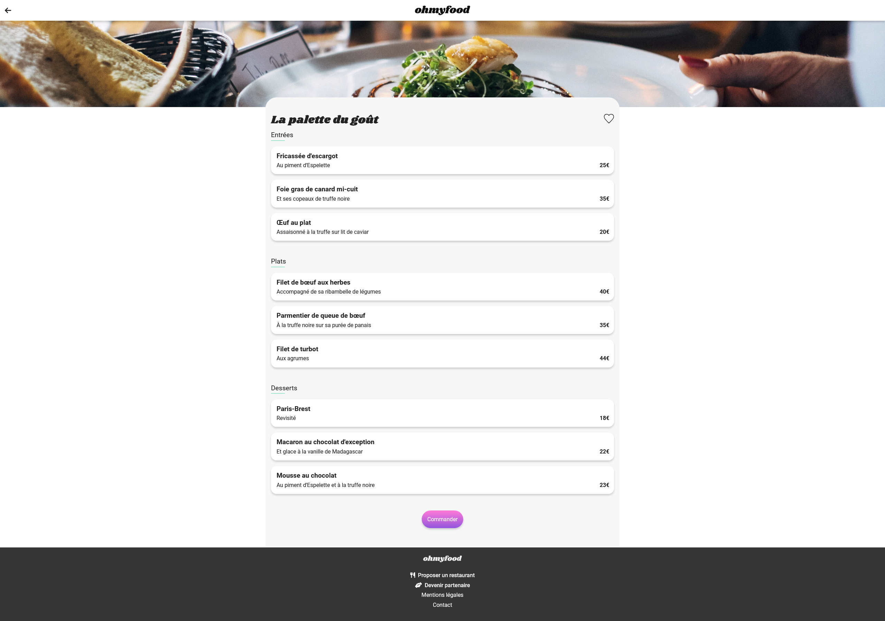

# Ohmyfood

Ohmyfood allows you to book your restaurant and menu from a pre-selected list accessible online. Ohmyfood was one step ahead of Booki. In this second project we had to use CSS animation to make a complete mobile application more dynamic. This was an opportunity for me to learn Sass, which was optional but very useful.

  

  

  

